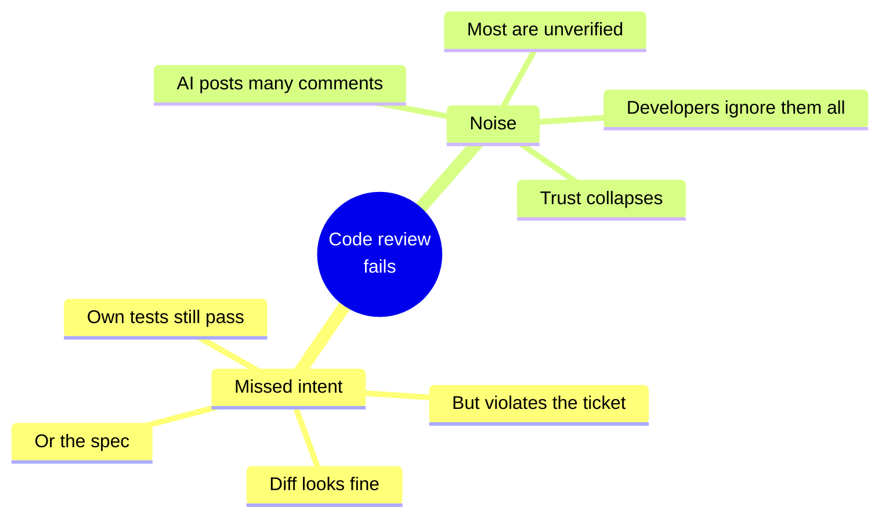
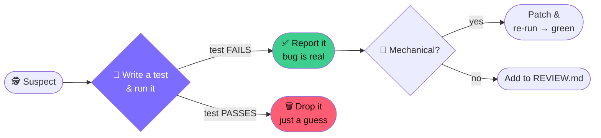
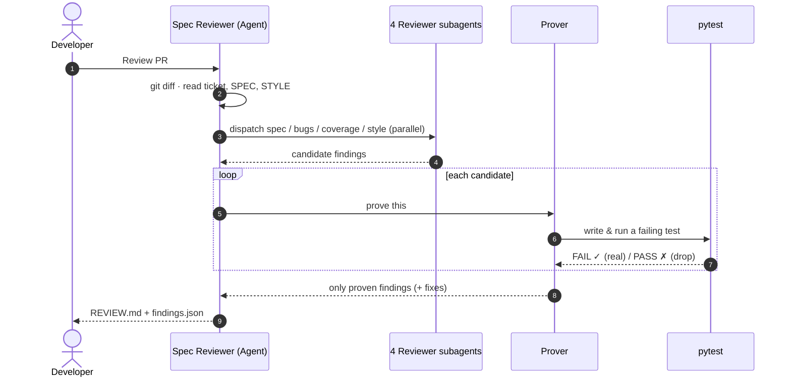
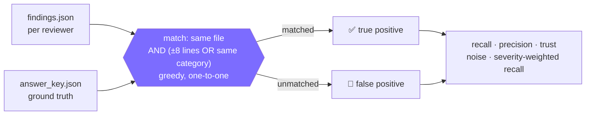
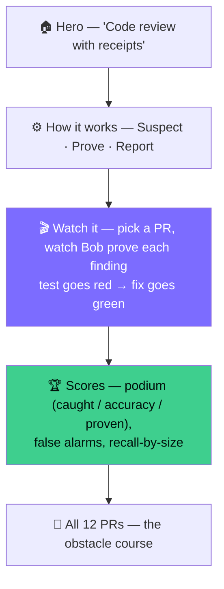

<div align="center">

# 🤖 Proof-Carrying Review

### Code review with receipts — built on IBM Bob 2.0

**A pull-request reviewer that reports a bug *only* when it can prove it with a failing test.**
No proof, no comment. Then it fixes what it can.

[](https://bob.ibm.com)
[](LICENSE)
[](#-live-demo--links)
[](https://python.org)

[Live demo](#-live-demo--links) · [How it works](#-how-it-works) · [Benchmark](#-the-benchmark) · [Run it](#-run-it-locally) · [Built with Bob](#-built-with-ibm-bob-20)

</div>

---

## 🎯 The problem

Code review is the slowest, least reliable step in most teams' workflow — and it fails in two ways:



The cost: hours of manual reading, bugs shipped to production, and rework a good review should have prevented.

## 💡 The idea

A custom **Spec Reviewer** mode for IBM Bob that reviews a PR against its **ticket + `SPEC.md` + `STYLE_GUIDE.md`** and enforces one rule:

> **A finding is reported only if Bob writes a `pytest` that *fails* because of it.**

That makes the review **zero-noise by construction**. Every finding ships with a reproducing test; the mechanical ones ship with a fix that turns the test green.



---

## 🏗️ How it works

The Spec Reviewer runs the whole review as one Bob task, orchestrated in **Agent mode** with **four parallel subagents** and a **prover**.

```mermaid
flowchart TD
    PR[📥 Pull request] --> G

    subgraph BOB["🤖 Spec Reviewer mode · IBM Bob 2.0"]
        G[["1 · Gather<br/>git diff + ticket + SPEC + STYLE"]]
        G --> D{{"2 · Dispatch — 4 subagents in parallel"}}
        D --> A1[spec conformance]
        D --> A2[bugs & security]
        D --> A3[test coverage]
        D --> A4[style compliance]
        A1 & A2 & A3 & A4 --> PV[["3 · Prove<br/>write a pytest per candidate,<br/>keep only the ones that FAIL"]]
        PV --> RP[["4 · Report<br/>REVIEW.md + findings.json + fix diffs"]]
    end

    RP --> SC[⚙️ scorer.py]
    SC --> DJ[[reviewboard/data.js]]
    DJ --> UI[🖥️ Dashboard]

    style BOB fill:#12141c,stroke:#7c6cff
    style PV fill:#7c6cff,color:#fff
    style PR fill:#1f5cff,color:#fff
    style UI fill:#3ecf8e,color:#00110a
```



### The review, as a sequence



### The two-repo architecture

```mermaid
flowchart LR
    subgraph TEST["📦 Test repo — IBM-Bob-Hackathon-TestCases"]
        TB[Taskboard library]
        SPEC[SPEC.md · STYLE_GUIDE.md · tickets/]
        PRS[12 pull requests<br/>21 planted issues · 2 clean]
    end
    subgraph SOL["🎯 Solution repo — IBM-Bob-2.0-Hackathon"]
        MODE[.bob/ Spec Reviewer mode]
        SCOR[scorer/ + answer_key.json]
        WEB[reviewboard/ dashboard]
    end
    MODE -->|reviews| PRS
    PRS -->|findings.json| SCOR
    SCOR -->|data.js| WEB
    style TEST fill:#141019,stroke:#a855f7
    style SOL fill:#0e1320,stroke:#1f5cff
```



---

## 📊 The benchmark

We score Proof-Carrying Review against two baselines on **12 PRs with 21 planted issues** (2 clean PRs measure false alarms).

| Reviewer | Bugs caught (recall) | Accuracy (precision) | Proven (trust)\* | False alarms / clean PR |
|---|:---:|:---:|:---:|:---:|
| 🥇 **Proof-Carrying Review** | **90%** | **100%** | **100%** | **0.0** |
| 🥈 Bob built-in review | 62% | 72% | 0% | 2.5 |
| 🥉 Naive single-prompt LLM | 48% | 43% | 0% | 6.5 |

\* **Proven** = share of findings backed by an executed failing test. Ours is 100% by design; the baselines can't verify anything.

```mermaid
xychart-beta
    title "Bugs caught by PR size (recall %)"
    x-axis [Small, Medium, Large]
    y-axis "Recall %" 0 --> 100
    bar "Proof-Carrying" [100, 92, 83]
    bar "Bob built-in" [83, 60, 40]
    bar "Naive LLM" [67, 45, 25]
```



Baselines collapse on large PRs — exactly where human review is weakest. Ours holds.

### How scoring works



Everything is computed by [`scorer/scorer.py`](scorer/scorer.py) — change a finding, re-run it, the numbers change. Nothing is hand-typed.

---

## 🖥️ The dashboard

A single-page site that pulls the PR list **live from the GitHub API** and visualises the scorer's output.



- **Live:** the pull-request list, titles and descriptions (fetched from `api.github.com`).
- **Computed:** every metric, from `scorer.py` on real findings + ground truth.

---

## 🗂️ Repository layout

```
.bob/                      Spec Reviewer mode (authored inside IBM Bob)
  custom_modes.yaml        mode definition
  rules-spec-reviewer/     gather → dispatch → report
  skills/
    spec-reviewer/         pipeline overview
    proof-writer/          write + run the proving tests
scorer/
  scorer.py                computes recall / precision / trust / noise
  answer_key.json          benchmark ground truth
  runs/{ours,bob,naive}/   each reviewer's findings, per PR
reviewboard/               dashboard (index.html · app.js · style.css · data.js)
evidence/                  IBM Bob task-session screenshots per team member
PLAN.md                    Bob's capability research + pipeline design
LICENSE                    MIT
vercel.json                serves reviewboard/ as the site root
```

---

## 🚀 Run it locally

**Dashboard** (static — pulls PRs live from GitHub):

```bash
cd reviewboard
python -m http.server 8777
# open http://127.0.0.1:8777
```

**Scorer** (recompute the numbers from the run files):

```bash
python scorer/scorer.py      # rewrites reviewboard/data.js and prints the leaderboard
```

---

## 🤖 Built with IBM Bob 2.0

Bob isn't a helper here — it **is** the product.

```mermaid
flowchart LR
    subgraph AUTH["Authored inside Bob"]
        CM[create-mode → Spec Reviewer]
        CS[create-skill → proof-writer, spec-reviewer]
        CP[create-plan → PLAN.md capability research]
    end
    subgraph RUN["Bob runs the workflow"]
        AG[Agent mode orchestration]
        SA[parallel subagents]
        DU[document understanding<br/>ticket · SPEC · STYLE]
        EX[terminal + pytest execution]
    end
    AUTH --> RUN --> OUT[real findings.json · scorer.py · REVIEW.md]
    style AUTH fill:#141019,stroke:#a855f7
    style RUN fill:#0e1320,stroke:#1f5cff
```



Bob wrote the reviewer, wrote the scorer, and performed the **actual reviews** — real line numbers, real failing-test output, real fix diffs (see `scorer/runs/ours/`). Per-member task-session evidence is in [`evidence/`](evidence/).

---

## 🔗 Live demo & links

| | |
|---|---|
| 🖥️ **Live dashboard** | _deployed on Vercel — add your URL here_ |
| 🎯 **Solution repo** | https://github.com/chiragshah2357/IBM-Bob-2.0-Hackathon |
| 📦 **Test-case repo (12 PRs)** | https://github.com/chiragshah2357/IBM-Bob-Hackathon-TestCases |

---

## 📄 License

[MIT](LICENSE) © 2026 Chirag Shah and contributors.
